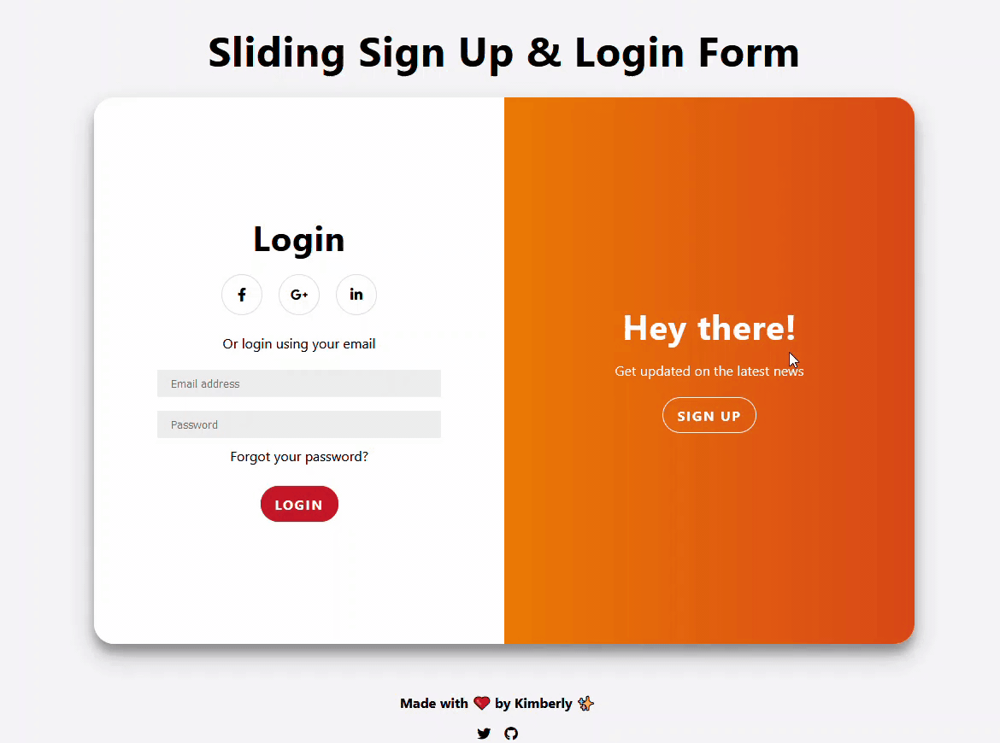

# Sliding Sign Up & Login Form

👉 [View live demo](https://vanillajs-only.netlify.app/03-sliding-sign-up-login-form)

## About

The main component `.container` has 4 smaller screens:

1. Login form
2. Sign Up form
3. Login overlay
4. Sign Up overlay

At any moment in time, you either see:

- Login form alongside Sign Up overlay
- Sign Up form alongside Login overlay

By clicking a `button` in one of the overlay panels, the click event triggers one of the combinations above.

## Forms Animation

Two containers `.form-container` each having `width: 50%` and `position: absolute`. Both containers are moved at the same time. When `.overlay-container` is on top, `z-index` value of one form will be higher than the other.

## Overlay Animation

There are 3 layers for this component:

1. `.overlay-container`

   The visible area that is displayed at any time. It has `width: 50%` of `.container`'s width

2. `.overlay`

   Takes up the full width of `.container`

3. `.overlay-panel`

   Contains actual texts and buttons. Both panels have `width: 50%` of `.overlay` component
