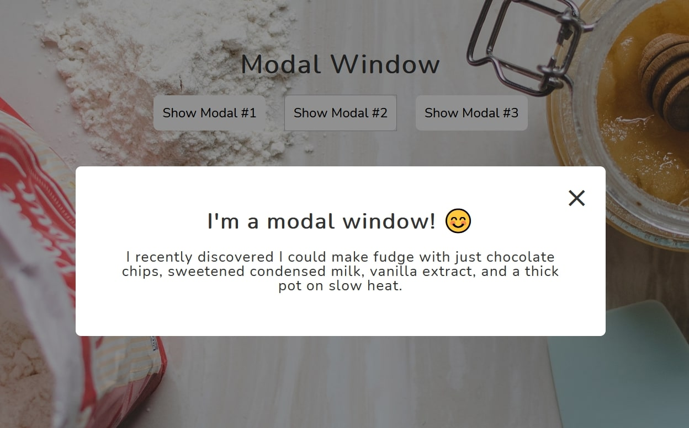

# Popup Modal Window

[👉🏻 View live demo](https://vanillajs-only.netlify.app/04-popup-modal-window)

By clicking one of the "Show Modal" buttons, the click event handler is triggered and a modal window pops up. Clicking on "X" button, hitting "esc" button or clicking anywhere outside of the modal window will close the popup modal.
