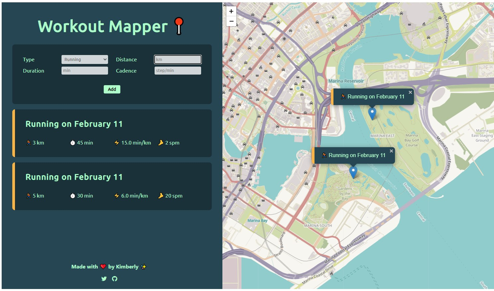

# Workout Mapper 📍

Log workouts based on current location using [Leaflet library](https://leafletjs.com/) and OpenStreetMap. Existing workouts are saved using local storage.

👉🏻 [View live demo](https://vanillajs-only.netlify.app/09-workout-mapper)

## User Stories

 

- Log running workouts with location, distance, time & steps/min

  ✔️ Map where user clicks to add new workout (able to get location coordinates)

  ✔️ Geolocation to display map at current location (more user-friendly)

  ✔️ Form to input distance, time & steps/ minute

 

- Log cycling workouts with location, distance, time & elevation gain

  ✔️ Form to input distance, time & elevation gain

 

- View all workouts at a glance

  ✔️ Display all workouts in a list

 

- View all workouts on a map using [Leaflet library](https://leafletjs.com/)

  ✔️ Display all workouts on a map

 

- View all workouts when return to app later

  ✔️ Store workout data in the browser using local storage API

  ✔️ On page load, read and display saved data

 

## Features

1. Geolocation to display map at current location
2. Map where user clicks to add new workout: running/ cycling
3. Form to input distance, time & steps/ minute (running)
4. Form to input distance, time & elevation gain (cycling)
5. Display workouts in a list
6. Display workouts on the map
7. Store workout date in the browser using local storage
8. On page load, read and display saved data
9. Move map to workout location on click
