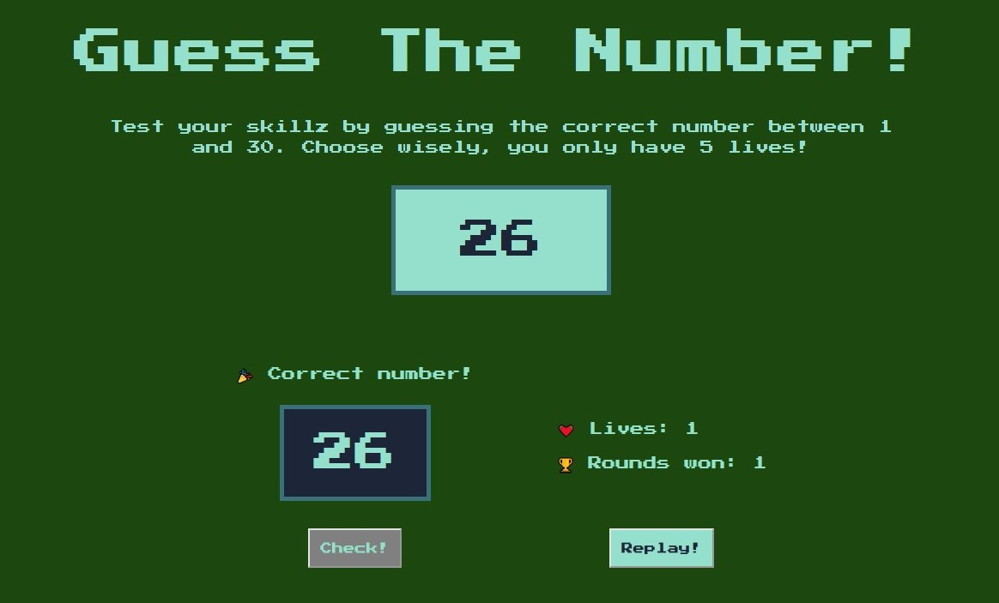

# Vanilla JavaScript Projects

A collection of projects that I've built using HTML, CSS and plain JavaScript.

[👉🏻 View all live demos](https://vanillajs-only.netlify.app/)

 

## 1. [Background Colour Picker 🎨](/01-background-colour-picker)

A website that displays a random background colour each time "Change colour" button is clicked.

[👉🏻 View live demo](https://vanillajs-only.netlify.app/01-background-colour-picker)

 

## 2. [Number Guessing Game 🎲](/02-number-guessing-game/)

Guess the correct number between 1 and 30. You only have 5 guesses before it's game over! How many rounds can you win without any losing streak?

[👉🏻 View live demo](https://vanillajs-only.netlify.app/02-number-guessing-game)

 

## 3. [Sliding Sign Up & Login Form](/03-sliding-sign-up-login-form)

A double slider with both sign up and login form.

👉🏻 [View live demo](https://vanillajs-only.netlify.app/03-sliding-sign-up-login-form)

 

## 4. [Popup Modal Window](/04-popup-modal-window)

A popup windows appears when a button is clicked. Clicking on "X", "esc" button or outside of modal will close the popup.

[👉🏻 View live demo](https://vanillajs-only.netlify.app/04-popup-modal-window)

 

## 5. [Pig Dice Game 🎲](/05-pig-dice-game/)

Players take turns to roll a single die as many times as they wish, adding all roll results to a running total, but losing their gained score for the turn if they roll a '1'.

👉🏻 [View live demo](https://vanillajs-only.netlify.app/05-pig-dice-game/)

 

## 6. [Photo Gallery 📸](/06-photo-gallery/)

30 photos of different sizes are generated using CSS grid. An outlay appears when an image is clicked.

👉🏻 [View live demo](https://vanillajs-only.netlify.app/06-photo-gallery)

 

## 7. [Keyboard Drum Kit 🥁](/07-keyboard-drum-kit/)

When a corresponding key is hit on the keyboard, two things will happen:

1. The drum sound associated with that key will be played
2. Short animation highlights which key was pressed

👉🏻 [View live demo](https://vanillajs-only.netlify.app/07-keyboard-drum-kit)

 

## 8. [Minimal Banking App 💰](/08-minimal-banking-app)

👉🏻 [View live demo](https://vanillajs-only.netlify.app/08-minimal-banking-app)
