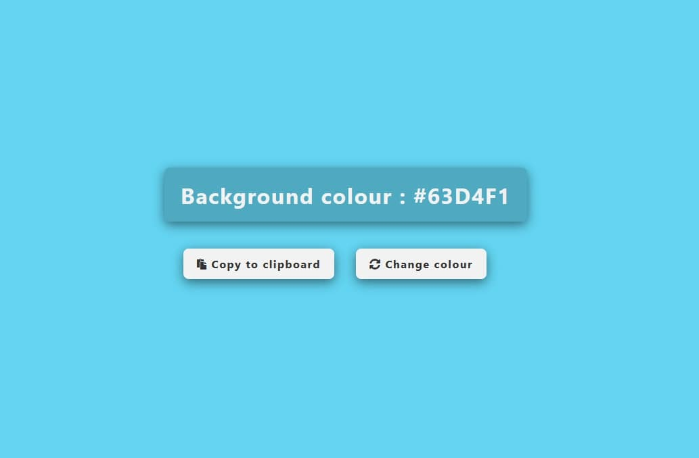

# Vanilla JavaScript Projects

A collection of projects that I've built using HTML, CSS and plain JavaScript.

View all live demos [here](https://vanillajs-only.netlify.app/).

## 1. [Background Colour Picker 🎨](https://vanillajs-only.netlify.app/01-background-colour-picker)

   A website that displays a random background colour each time "Change colour" button is clicked.

## 2. [Number Guessing Game 🎲](https://vanillajs-only.netlify.app/02-number-guessing-game/)

   Guess the correct number between 1 and 30. You only have 5 guesses before it's game over! How many rounds can you win without any losing streak?

